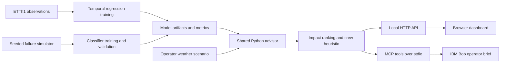

# Architecture

| Component | Technology | Responsibility |
|---|---|---|
| Training | pandas, scikit-learn | Causal features, temporal splits, model selection, evaluation |
| Artifacts | joblib and JSON | Local trained models, metrics and forecast traces |
| Advisor | Python | Scenario validation, probabilities, impact and constrained crew assignments |
| API | ThreadingHTTPServer | Fixed static routes and read-only analysis endpoints |
| UI | Vanilla JavaScript and SVG | Scenario controls, schematic, equipment details and evidence |
| Bob | MCP Python SDK | Read-only tools calling the shared engine |

The HTTP server binds only to localhost. It is a development server, with no authentication, production hardening or multi-user persistence. Do not expose it publicly. Model files must be locally generated: joblib artifacts can execute code when loaded, so never load untrusted files. No credentials are needed by the dashboard. Bob's own sign-in is external to this application.
