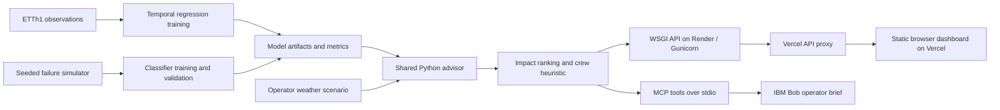

# Architecture

| Component | Technology | Responsibility |
|---|---|---|
| Training | pandas, scikit-learn | Causal features, temporal splits, model selection, evaluation |
| Artifacts | joblib and JSON | Local trained models, metrics and forecast traces |
| Advisor | Python | Scenario validation, probabilities, impact and constrained crew assignments |
| Public demo API | WSGI + Gunicorn on Render | Read-only JSON routes, bounded inputs and health checks |
| Local API | ThreadingHTTPServer | Local development and fixed static routes |
| Hosting | Vercel + Render | Static frontend, same-origin API proxy and model build |
| UI | Vanilla JavaScript and SVG | Scenario controls, schematic, equipment details and evidence |
| Bob | MCP Python SDK | Read-only tools calling the shared engine |

`server.py` remains a localhost development server. Public deployment uses `wsgi.py` behind Gunicorn and Render's HTTPS proxy; it does not expose filesystem or model download routes. Vercel forwards `/api` traffic to the configured Render origin. The service intentionally exposes fictional, read-only demo data without login. It has no multi-user persistence, live utility connection or dispatch capability. Do not add real private utility records without a separate authentication, authorization and data-security design. Model files are generated by training during the Render build; never load untrusted joblib files. Bob's own sign-in and stdio MCP session are external to the deployed website. The diagram describes the configured deployment; live status is tracked in `docs/submission-status.md`.
